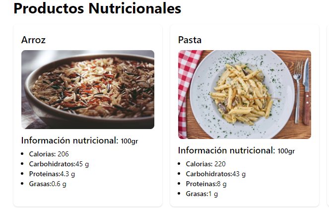
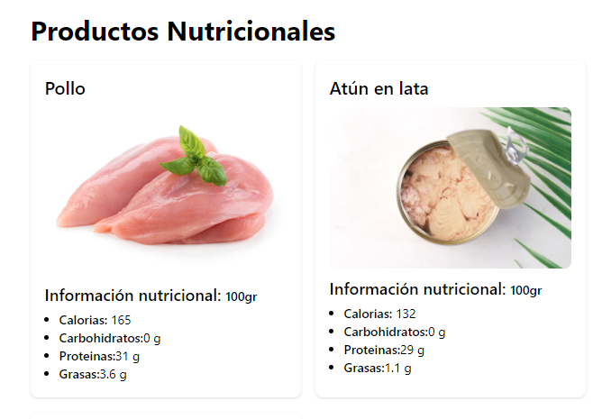

# Proyecto de Información Nutricional de Alimentos

Este proyecto es una aplicación web que permite a los usuarios obtener información nutricional detallada sobre ciertos alimentos. La aplicación está desarrollada utilizando React, Tailwind CSS, React Router y Vite para una experiencia de desarrollo moderna y eficiente.

## Características

- **Información Detallada:** La aplicación muestra información detallada sobre calorías, macronutrientes y otros datos relevantes.
- **Interfaz Moderna:** Diseño limpio y moderno gracias al uso de Tailwind CSS.
- **Enrutamiento React:** Utiliza React Router para manejar la navegación entre diferentes secciones de la aplicación.

## Tecnologías Utilizadas

- **React**: Biblioteca de JavaScript para construir interfaces de usuario.
- **Tailwind CSS**: Framework de diseño utilitario para estilizar rápidamente la aplicación.
- **React Router**: Librería de enrutamiento para aplicaciones React de una sola página.
- **Vite**: Herramienta de desarrollo rápida para aplicaciones web modernas.

## Capturas de Pantalla

A continuación se muestran algunas capturas de pantalla de la aplicación:

## Uso

- **Navegación:** Utiliza los enlaces de navegación para explorar diferentes secciones de la aplicación.

### Visita mi aplicación desplegada:

[¡Haz clic aquí para ver la aplicación en vivo!](https://javiergualpa1503.github.io/NutriFoods)
